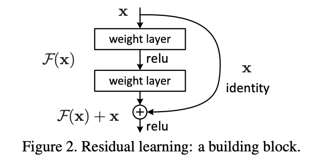

# Quick links

- [Tutorials](https://docs.fast.ai/tutorials.html)
- [Simple answer of How Deep Learning works?](https://youtu.be/PW2HKkzdkKY?t=6747)
- [Neural net from scratch](https://youtu.be/uQtTwhpv7Ew?t=5039)
- [Convolutional Neural Network - CNN Explaination](https://youtu.be/U7c-nYXrKD4?t=3914)

# Data Notes

## Batch size for Image Segmentation problem | Free memory

```python
size = src_size//2
free = gpu_mem_get_free_no_cache()
if free > 8200: bs=8
else:           bs=4

# after that, if we want to train more with larger size, then do
learn.destroy()
size = src_size
free = gpu_mem_get_free_no_cache()
if free > 8200: bs=3
else:           bs=1
```

## Cleaning Data

- Use FileDeleter/ImageCleaner to show the top loss images for verifying/deleting them.
- After cleaning, retrain, it's normal if the model is 0.01% better.
- It's fine, just make sure we don't have too much noise in dataset.

## How much data?

- Most of time, we need less data than we think.
- Get it more if you're not satisfied with accuracy.

## How (and why) to create a good validation set

- https://www.fast.ai/2017/11/13/validation-sets/
- [**TRICK**] Train set = Train + Valid set (in Kaggle)

## Labeling Data

- Use platform.ai for auto labeling

## Unbalanced data

- 200 black bears, 50 teddies? -> It still works!

# Training Notes

## Training Flow

- Data: [Ex 1](https://nbviewer.jupyter.org/github/fastai/course-v3/blob/master/nbs/dl1/lesson1-pets.ipynb)
  - Check path.ls() and images name
  - Init random seed
  - Create databunch and normalize
    - Use small input size first
  - Check train_ds, valid_ds, classes and show_batch
- Train
  - Create learner and check model
  - Train last layer (when freezing)
    - Find LR, train and check result
  - Train the whole model (when unfreezing)
    - Find LR, train and check result
- Improve and Trick
  - Data
    - Clean dataset by using FileDeleter/ImageCleaner (for images)
    - Increase input size
    - [Augmentate data](https://docs.fast.ai/vision.transform.html#List-of-transforms)
    - Combine train and valid set to create train set (Kaggle)
  - Create new learner
    - Use more complex model
    - Use [weight decay](https://github.com/hiromis/notes/blob/master/Lesson5.md)
    - Use [dropout](https://github.com/hiromis/notes/blob/master/Lesson6.md)
    - Use [.to_fp16()](https://nbviewer.jupyter.org/github/fastai/course-v3/blob/master/nbs/dl1/lesson3-camvid.ipynb)
    - Use [ResBlock or DenseNet](https://github.com/hiromis/notes/blob/master/Lesson7.md)
    - Use [Batch Normalization](https://github.com/hiromis/notes/blob/master/Lesson6.md) (default in fastai)
  - Train last layer (when freezing)
    - [Freeze model](https://nbviewer.jupyter.org/github/fastai/course-v3/blob/master/nbs/dl1/lesson3-planet.ipynb)
    - Find LR, train and check result
    - Use [momentum]((https://github.com/hiromis/notes/blob/master/Lesson5.md))
  - Train the whole model (when unfreezing)
    - Find LR, train and check result
    - Use momentum

## Problem Types

- [Image Classification 1](https://nbviewer.jupyter.org/github/fastai/course-v3/blob/master/nbs/dl1/lesson1-pets.ipynb);
[Image Classification 2](https://nbviewer.jupyter.org/github/fastai/course-v3/blob/master/nbs/dl1/lesson6-pets-more.ipynb)
  - Data: ImageDataBunch
  - Learner: cnn_learner
- [Multi-label Image Classification](https://nbviewer.jupyter.org/github/fastai/course-v3/blob/master/nbs/dl1/lesson3-planet.ipynb)
  - Data:
    - ImageFileList
    - .from_folder
    - .label_from_csv
    - .random_split_by_pct
    - .datasets
    - .transform
    - .databunch
    - .normalize
  - Learner: cnn_learner
- [Image Segmentation](https://github.com/fastai/course-v3/blob/master/nbs/dl1/lesson3-camvid.ipynb)
  - Data:
    - SegmentationItemList
    - .from_folder
    - .split_by_fname_file
    - .label_from_func
    - .transform
    - .databunch
    - .normalize
  - Learner: unet_learner
- [Regression](https://nbviewer.jupyter.org/github/fastai/course-v3/blob/master/nbs/dl1/lesson3-head-pose.ipynb)
  - Data:
    - ImageItemList
    - .from_folder
    - .split_by_valid_func
    - .label_from_func
    - .transform
    - .databunch
    - .normalize
  - Learner: cnn_learner
- [Natural Language Processing](https://nbviewer.jupyter.org/github/fastai/course-v3/blob/master/nbs/dl1/lesson3-imdb.ipynb)
  - Data:
    - TextList
    - .from_folder
    - .filter_by_folder
    - .split_by_rand_pct
    - .label_for_lm
    - .databunch
  - Learner: language_model_learner (train encoder)
  - Data:
    - TextList
    - .from_folder
    - .split_by_folder
    - .label_from_folder
    - .databunch
  - Learner: text_classifier_learner (train text classifier)
- [Tabular 1](https://nbviewer.jupyter.org/github/fastai/course-v3/blob/master/nbs/dl1/lesson4-tabular.ipynb);
[Tabular 2](https://nbviewer.jupyter.org/github/fastai/course-v3/blob/master/nbs/dl1/lesson6-rossmann.ipynb);
[Tabular 3](https://nbviewer.jupyter.org/github/fastai/course-v3/blob/master/nbs/dl1/rossman_data_clean.ipynb)
  - Data:
    - TabularList
    - .from_df
    - .split_by_idx
    - .label_from_df
    - .add_test
    - .databunch
  - Learner: tabular_learner
  - People often use logistic regression, random forests, or gradient bossting machine for
  tabular data. But using neural nets nowadays tends to be reliable and effective.
- [Collaborative Filtering](https://nbviewer.jupyter.org/github/fastai/course-v3/blob/master/nbs/dl1/lesson4-collab.ipynb)
  - Data:
    - CollabDataBunch
    - .from_df
  - Learner: collab_learner
- [Image Restoration with GAN](https://nbviewer.jupyter.org/github/fastai/course-v3/blob/master/nbs/dl1/lesson7-superres-gan.ipynb);
[Image Restoration with WGAN](https://nbviewer.jupyter.org/github/fastai/course-v3/blob/master/nbs/dl1/lesson7-wgan.ipynb);
[Image Restoration with Feature Loss](https://nbviewer.jupyter.org/github/fastai/course-v3/blob/master/nbs/dl1/lesson7-superres.ipynb);
  - Low res --> high res
  - Black-and-white --> color
  - Cut out --> replace the cutout
  - Turn image into what looks like a line drawing
  - Turn image into what looks like Monet painting

## Statements
- Training Loss should be ALWAYS < Validation Loss
- Training/Valid Loss goes up a bit be4 goes down.
Because LR starts low, goes up, and then goes down.
- Error Rate tells you if the model is overfitting
- If you're still under fitting, then you have to decrease regularization.
Ex: weight decay, dropout, data augmentation, ...
- [**TRICK**] Make a lot of smaller datasets to step up from in tuning.
Ex: 64x64, 128x128, 256x256, ...
- [**TRICK**] Create learner using `.to_fp16()` method for computing
in 16-bit floating point instead of 32-bit. Less precise but better result and faster training.
- [**TRICK**] We will want some Weight Decay, and a bit of Dropout. Just try, no one knows!
- [**TRICK**] U-Net is suitable for segmentation problem,
especially for Biomedical image segmentation.
- [**TRICK**] Use [add_datepart function](https://youtu.be/U7c-nYXrKD4) for tabular problem.
- [**TRICK**] Use `log=True`: Anytime you're trying to predict sth like a population or
a dollar amount of sales, these kind of things tend to have long tail distributions where you care
more about percentage differences and exact/absolute differences. So you want to use `log=True`
to measure root mean squared percent error.

## Activation function

- Is an element-wise function. It does calculation on every elements.

## Adam Optimizer - Do both momentum and RMSProp

- These optimizes are called **Dynamic Learning Rate**.


Ex: When LR is small, momentum is large.

## Affine function

- Is Matrix Multiplication (same)
- Is Linear function

## Back Propagation

- Update weights matrixes/params

```python
# update param by substracting it from
# product of its gradient and learning rate
param -= (lr * param.grad())
```

## Batch Normalization

- We have: 
  -  is predictions,
   is inputs.
- With BN, we have 
- BN shifts outputs up and down, in and out (`g` and `b` are learned params).
- We definitely want to use it! It accelerates training (less training steps).

## Bias


- In Collaborative Filtering system, maybe there are certain movies that everybody likes more.
Maybe there are some users that just tend to like movies more.
- There're also some cases that if a movie doesn't have a feature that a user likes, but the movie
is very good and others like it. Then we need some ways to say "unless if it's that movie".
- So I want to add a single number of like how popular is this movie, and add a single number of
like how much does this user like movies in general. So those are called `bias` terms.
- We don't just want to have prediction equals dot product of these two things, we want to say
it's the dot product of those two things plus a bias term for a movie plus a bias term for user ID.
- Now each movie can have an overall "this is a great movie" vs "this isn't a great movie" or every
user can have an overall "this user rates movie highly" or "this user doesn't rate movies highly".

## Cold Start Problem in collaborative filtering | Recommendation System

- Recommend movies for a new user, or recommend a new movie for users.
At this point, we don't have any data in our collaborative filtering system.
- Solution 1: Ask user about some movies if he likes it
- Solution 2: Have a second model which is NOT a collaborative filtering model
but a METADATA driven model for new users or new movies.
Ex: If you're selling products and you don't want to show them a big selection
of your products and say did you like this because you just want them to buy.
You can instead try and use a metadata based tabular model what geography did they come from,
their age and sex, you can try and make some guesses about the initial recommendations.

## Cross Entropy Loss function

```python
if y == 1: return -log(y_hat)
else: return -log(1 - y_hat)
```

- MSE is not good when we need sth where predicting the right thing correctly and confidently
should have very little loss; predicting the wrong thing confidently should have a lot of loss.
Ex: `mse(4,3)` is still small --> it should be big!

## DenseNet

.png)

- Instead of `x+Conv2(Conv1(x))`, it goes `cat[x,Conv2(Conv1(x))]`. In other words,
rather than putting a plus in this connection, it does a concatenate.
- Dense block is getting bigger and bigger. Note that the exact input is still here. DenseNet is
memory intensive. But they have very few params.
- They tend to work really well on small datasets and for segmentation problems (because they
keep the original input pixels and in segmentation, you want to be able to reconstruct
original resolution of picture).

## Dropout

- Everytime we have a mini batch going through, we randomly throw away some of the activations.
We throw each one away with probability `p` (default `p=0.5`). Then the next mini batch, we put
them back and throw away some different ones --> No activation can memorize some part of input!
- If we overfit, some part of model is learning to recognize a particular image rather than
a feature in general.
- Ex: `ps=[0.001, 0.01]`: 0.001 is dropout of 1st layer, 0.01 is for next layer.
- Ex: `emb_drop=0.04`: special dropout for embedding layer.

## Embedding


- Is a matrix of weights
- In this case, we have an embedding matrix for a user and an embedding matrix for a movie.

## Encoder

- Encoder in NLP model is responsible for creating, updating hidden states (understand sentences)
- Encoder is the first half of NLP model. The second half is all about prediting the next word.

## Feature Loss | Perceptual Loss


- "Can we get rid of GANs entirely?" --> We want a better loss function that can say
this is a high-quality image without having to go all the GAN trouble.
- The generator is called the "image transform net". It's got U-Net shaped.
At the time this came out, nobody in the machine learning world knew about U-Nets.
- We take the prediction and we put it through a pre-trained ImageNet network.
At the time that this came out, the pre-trained ImageNet network they were using was VGG.
It's kind of old now, but people still tend to use it because it works fine for this process.
It doesn't matter too much which one it is.
- Normally, the output would tell you "is this generated thing a dog, or a fire engine or whatever?"
But in the process of getting to that final classification,
it goes through lots of different layers. In this case, they've color-coded all the layers with
the same grid size and the feature map with the same color.
- Let's not take the final output of the VGG model, but let's take the activations of
some layer in the middle. Those activations, it might be a feature map of like 256 channels
by 28 by 28. So those kind of 28 by 28 grid cells will roughly semantically say things like
"in this part of that 28 by 28 grid, is there something that looks kind of furry? Or is there
something that was kind of circular? Is there something that kind of looks like an eyeball?"
- We take the target (i.e. the actual `y` value) and put it through the same pre-trained
VGG network, and pull out the activations of the same layer. Then we do a mean square error
comparison. So it'll say "in the real image, grid cell (1, 1) of that 28 by 28 feature map is
furry and blue and round shaped. And in the generated image, it's furry and blue and
not round shape." So it's an okay match.
- The feature map is going to say "there's eyeballs here (in the target), but there isn't here
(in the generated version), so do a better job of that please. Make better eyeballs."
That's what we call `feature losses` or Johnson et al. called `perceptual losses`.
- [Link](https://nbviewer.jupyter.org/github/fastai/course-v3/blob/master/nbs/dl1/lesson7-superres.ipynb)

## [Find Learning Rate](https://sgugger.github.io/how-do-you-find-a-good-learning-rate.html)

- Sometimes the tricks to choose LR below don't work. We should try 10x less, 10x more and see
what looks best.

## Find Learning Rate before unfreezing | freezing | frozen


- Find the thing with the steepest slope, somewhere around 1e-2.
- In this case, choose slice(1e-2)


- LR = (Be4 it shoots up)/10 = 1e-2/2

## Find Learning Rate after unfreezing | unfreeze


- Fine the strongest downward
- Min LR = on the top of that slope, shift a bit to the right
- Max LR = (LR at frozen)/10 or /5
- In this case, choose slice(3e-5, 3e-4)


- In this case:
- Min LR = (Be4 it shoots up = 1e-4)/10 = 1e-5
- Max LR = (LR at frozon)/5

## Generative Adversarial Network | GAN


- We've got our crappy image, and we train a generator. `Generator` is a model which generates a restored image (in image restoration problem). We have a high-res image (target) and we can compare the high-res image to the prediction with pixel MSE.
- We train another model which is called either the `discriminator` or the `critic`. We build a `binary classification` model that takes all the pairs of the generated image and the real high-res image, and learn to classify which is which. We fine tune the generator and the loss function is
the `critic`.
- We train generator a few batches. But the critic isn't that great.
After we train the generator a little bit more using that critic as the loss function,
the generators going to get really good at falling the critic.
Now we'll train the critic some more on these newly generated images. Once we've done that and
the critic is now good at recognizing the difference between the better generated images and
the originals, we'll fine tune the generator some more using the better discriminator
as the loss function.
- So we'll just go ping pong ping pong, backwards and forwards. That's a GAN.
That's our version of GAN. We've created a new version of GAN which is kind of a lot like
the original GANs but we have this neat trick where we pre-train the generator and we pre-train
the critic.
- [**TRICK**] GANs hate momentum. It doesn't make sense to train them with momentum
because you keep switching between generator and critic. Maybe there are ways to use momentum,
but I'm not sure anybody's figured it out. When you create an Adam optimizer is where the momentum
goes, so you should set that to zero ([link](https://nbviewer.jupyter.org/github/fastai/course-v3/blob/master/nbs/dl1/lesson7-superres-gan.ipynb))

## Latent factor | Latent feature

- In collaborative filtering user&movie system, we multiply 2 matrixes.
- If there's a number in embedding of user is high, and the corresponding number of it in embedding
of movie is also high, then the result of their product is high too. It means the movie has a
feature that that user likes.
- We don't decide the rows mean anything. But the only way that this gradient descent could come up
with a good answer is if it figures out what the aspects of movie taste are and the corresponding
features of movie are.
- The underlying features are called latent features. They are hidden things. Once we train this
neural net, they suddenly appear.

## Logistic Regression Model

- Is a neural net with NO HIDDEN LAYERS, it's a one layer neural net NO NONLINEARITIES.

## Loss function

- The thing that's telling you how far away or how close you are to the correct answer.
- For classification problems, we use cross entropy loss, known as negative log likelihood loss.
This penalizes incorrect confident predictions, and correct unconfident predictions.

## Matrix Factorization

- Is a class of collaborative filtering algorithms used in recommendation system.
- Works by decomposing the user-item interaction matrix into the product of
2 lower dimension matrixes.
- Number of factors is the width of the embedding matrix.
- Why number of factors = 40? Try few things and see what looks best.

## Mean Squared Error - Loss function

```python
def mse(y_hat, y): return ((y_hat-y)**2).mean()
```

## Mini-batches

- The only difference between stochastic gradient descent and gradient descent is
something called mini-batches.
- We calculated the value of the loss on the whole dataset on every iteration.
But if your dataset is 1.5 million images in ImageNet, that's going to be really slow.
- What we do is we grab 64 images or so at a time at random, and we calculate the loss
on those 64 images, and we update our weights.
- Mini-batches: A random bunch of points that you use to update your weights

## Momentum - Keep track of EWMA of step

- Previously, we have: 
- Now, we have: 
  - With 
-  is called Exponentially
weighted moving average, because 
are going to multiply with ,
 ...
-  is momentum part,
often has value of 0.9 --> 

## Neural Network | Architecture


- Yellow: `Parameters`: Number that are stored to make a calculation. Ex: Numbers inside matrixes
- Purple & Blue: `Activations`: Result of a calculation, numbers that are calculated.
Ex: result of a matrix multiply or an activation function (ReLU's output)
- Red Arrows: `Layers`: Things that do a calculation.
There're 2 types of layers (except input/output layers):
  - Yellow: Layers contain params
  - Blue: Layers contain activations
- `ReLU`: an activation function.

## [Normalize](https://docs.fast.ai/vision.data.html#ImageDataBunch.normalize)

- Normalize using mean and std of data 

## Parameters | Coefficients | Weights

- Numbers that you are updating.

## PCA - Principal Components Analysis

- There isn't really conceptually `n` latent factors in a model. We want to squish `n` (ex: 40) down
to just `m` (ex: 3). PCA is a simple linear transformation that takes an input matrix and
tries to find a smaller number of columns that cover a lot of the space of that original matrix.

## plot_losses in fastai | plot losses


- When we plot losses in fastai, it doesn't look like above. It looks like below


- Because fastai calculates the EWMA of the losses --> easier to read chart.

## Production

- Let CPU predict in production.
- CPU can do lots of things at the same time, but not GPU.
- Use PythonAnyWhere, Zeit, Render.com for free hosting

## Recurrent Neural Network | RNN

.png)

- We want to predict word 4 using words 1 and 2 and 3.
  - Rectangle to circle: do an embedding (matrix multiply where you have a one hot encoded input)
  - Circle to circle: take one piece of hidden state (ex: activations) and turning it into
  another set of activations by saying we're now at the next word.
  - Circle to triangle: convert the hidden state (ex: these activations) into an output.
- Each of the same color arrows should use the same weight matrix because it's doing the same thing.
Why would you have a different set of embeddings for each word or a different matrix to multiply
by to go from this hidden state to this hidden state versus this one?


- In the `forward`, we take input x[0], put it through input to hidden `i_h` (the green arrow),
create first set of activations `h`. Assuming that there is a second word, because sometimes
we might be at the end of a batch where there isn't a second word. We add x[1] to h,
the result of x[1] put through the green arrow `i_h`. Our new `h` is the result
of those two added together, put through our hidden to hidden `h_h` (orange arrow), and then
ReLU then batch norm. Then for the third word, do exactly the same thing.
Then finally blue arrow - put it through `h_o`.

.png)

- This is the same diagram, we refactor into a loop. That's an RNN. An RNN is just a refactoring.
- We are comparing the result of our model to just the last word of the sequence.
It is very wasteful, because there's a lot of words in the sequence. So let's compare every word
in `x` to every word and `y`. To do that, we need to change the diagram so it's not just one triangle
at the end of the loop, but the triangle is inside the loop, like this:


- One more thing you could do is at the end of your every loop, you could not just spit out
an output, but you could spit it out into another RNN. So you have an RNN going into an RNN:


- But think about it without the loop. It looks like this:


- It keeps on going, and we've got a BPTT (back prop through time) of 20, so there's 20 layers
of this. When you start creating long timescales and multiple layers, these things get impossible
to train. One thing is you can add skip connections. But what people normally do is they actually
use a little mini neural net to decide how much of the green and orange arrow to keep. You get
GRU or LSTM depending on the details of that little neural net. This is a super valuable technique.

## RMSProp - Keep track of EWMA of the gradient squared

- We have: 
  - With: 

## Skip Connection | Identity connection | ResNet Block | ResBlock



- We want to create a deeper network by adding a stride 1 conv after every stride 2 conv, because
stride 1 conv doesn't change the feature map size --> It will have many layers --> Overfit.
- We expect its training error zip down to 0 quickly --> No, it worse!
- Solution: Every 2 convolutions, we add together input to those 2 convolutions with their result.
This should be at least as good as the original network.
- Instead of this 
  - we have: 

## Softmax - Activation function

- 
- When we do single-label multi-class classification, we want `softmax` as our activation function
and cross-entropy as loss function, because these things go together in such friendly ways.
`Pytorch` will do this for us.
- The `nn.CrossEntropyLoss` is not really just cross-entropy loss, it's actually `softmax` then
cross-entropy loss.

## Transfer Learning in FastAI | Discriminative Learning Rate | one cycle


- What happened to the last layer?
  - In ResNet34, last layer has 1000 cols (1000 classes in ImageNet).
  fastai replaces it with 2 new weight matrixes with a ReLU in between
  - The first matrix has some default sizes. The second one has 'data.c' cols
- Freezing layers
  - When calling fit 1st time, it means don't back propagate the gradients back to those other
  layers except the 2 new ones.
- Unfreezing and Using Discriminative Learning Rates
  - After a while, we say "this model is looking pretty good. We should train the rest of the
  network now" --> We unfreeze.
  - But we know that: "The new layers need more training, and the ones at the start don't need
  much training" --> We split out model into a few sections and give them different LRs.
  --> This process is called Using Discriminative Learning Rates.
  - In `fit`/`fit_one_cycle` function params, we put the LR as a number/slice(number)/ or
  slice(number, number) (learn about one cycle [here](https://docs.fast.ai/callbacks.one_cycle.html#What-is-1cycle?))
    - Number: every layer get the same LR --> not using discriminative LRs
    - slice(Number): the final layers get Number, the others get Number/3
    - slice(Num1, Num2): the 1st group of layers get Num1, second get (Num1+Num2)/2, third get Num2.
    By default, there're 3 groups: 3rd one is the new layers, 1st and 2nd ones are splitted half
    of the rest.

## Underfitting | Overfitting


## U-Net


- We can use nearest neighbor interpolation, bilinear interpolation for up-conv (the right part).
- fastai uses `sub pixel convolutions` or `pixel shuffle` for up-conv.
- At the bottom of U-Net, how the heck is it going to have enough information to reconstruct a
572x572 output space? --> Tough Ask!
  - Add skip connection?
  - Actually they append/concatenate --> Use DenseNet
  - So many computations are on the top
- Moreover, we replace the left part/the downsampling part/the encoder part (the upsampling part is
the decoder part) with ResNet34 - Replace old architecture with ResNet34.
- U-Nets are for when the size of output is similar to the size of input and kind of
aligned with it. Ex: segmentation, not classifier (for classifier, you just want to downsampling
the input).

## Universal Approximation Theorem

- If we have enough weight matrixes, it can solve any arbitrarily complex mathematical function
to any arbitrarily high level of accuracy (assuming we can train params in terms of time and
data availability...)

## Wasserstein GAN


- Input is this LSUN bedrooms dataset. The input to the generator isn't an image that we clean up.
We feed to the generator random noise. Then the generator's task is "can you turn random noise
into something which the critic can't tell the difference between that output and a real bedroom?" -
[link](https://nbviewer.jupyter.org/github/fastai/course-v3/blob/master/nbs/dl1/lesson7-wgan.ipynb)

## Weight Decay - Penalize the complexity of model

- Previously, we update weights by using 
  - With 
  - And `m` is our model
- Then, we have: 
  - Remove Sigma sum symbol is okay.
- All weight decay does is it subtracts some constant times the weights every time we do a batch.
We can replace `wd` with `2wd` without loss of generality.
  - When it's ()
  where we add the square to Loss function --> it's called **L2 Regularization**.
  - When it's ()
  where we subtract  times weights
  from the gradients --> it's called **weight decay**.
- By using WD, we can make giant NN and still avoid overfitting, or really small datasets with
moderately large sized models and avoid overfitting.
- Sometimes, you might still find you don't have enough data in cases where you're not overfitting
by adding lots of weight decay and it's just not training very well.

## Y Range in collaborative filtering

- Use sigmoid to make result in (0, 1)
- User y_range=[0, 5.5] because there's movie with 5 stars, but sigmoid never get to 5.
  - [**TRICK**] Make Y Range wider than range of data
